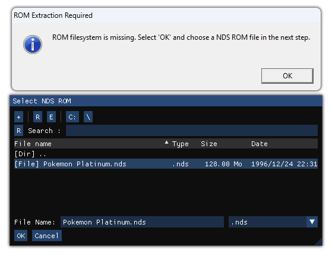

# Pokémon Platinum PC Port

This is an experimental PC port of Pokemon Platinum based on the [pret](https://github.com/pret/pokeplatinum) decompilation project. It is powered by the [libntr](https://github.com/cybervisi0n/libntr) suite, a collection of libraries that replace the NitroSDK to allow for easy porting of Nintendo DS titles.

Feel free to join us on [Discord](https://discord.gg/ZgtPszuBeN) for discussion or support.

It should be possible to play the game from start to finish, but there could be crashes and graphical bugs. 

Generative AI/LLM shortcuts were **not** used in the creation of this project and the libntr libraries. **Pull requests or code suggestions using AI will be rejected.**

Project goals:
* Create a native port of pokeplatinum for 64-bit PC platforms
* * Long term: Create native ports for homebrew on various game consoles
* Facilitate modding by allowing both a PC port and DS ROM to be compiled and debugged from the same source tree
* Support all WiFi and multiplayer features

## Setup Guide
To run the [pre-built binaries found in the releases tab](https://github.com/cybervisi0n/pokeplatinum/releases), **you MUST dump and provide your own US ROM of Pokémon Platinum (CPUE01).** On first launch, you will be prompted to select your .nds ROM file as seen in the images below:

* After this has been completed once, you can launch the game simply by running main.exe.
* Access in-game settings and debug tools by pressing TAB

### Playing in other languages
Currently, this project only supports the USA version of the game, however, it is possible to change the language of the majority of the in-game text by replacing some files. 
Once a ROM has been loaded, its contents will be extracted in the same directory as main.exe. Replace the following files with copies from another language:

 * msgdata/msg.narc
 * msgdata/pl_msg.narc
 * msgdata/scenario/scr_msg.narc

## Building on Linux
### Dockerized build (Recommended)
This only requires Docker to be installed and setup on your system. The drun.sh script is used to build the docker image and run build commands in it. Build with:
* ./drun.sh make linux

The container image will automatically be built the first time this script is run.

### Non-container build
Required Packages (arch linux):
* nasm
* enet
* arm-none-eabi-gcc (required by the base pret project)
* ninja
* flex
* bison

To build: 
* make linux

Alternatively:
* meson setup build
* cd build
* meson configure -Dbuild_target=linux
* meson compile

You can also build a ROM from the same source tree, just run:
* make

## Building on Windows
From a freshly cloned repo, run the "Install_MSys2.ps1" script in powershell. This will create a portable MSys2 build environment with all dependencies installed in the repo. This only has to be done once per repo.

To build, run "Launch_MSys2.ps1" and it will launch a MSys2 bash shell. From here, run "make win64" to build.

## NX Build Target (working, but poor performance)
This build target requires DevKitA64, this is already installed in the build container.
* ./drun.sh make nx

## Notes
Target executable will be in ./build_(platform)/pokeplatinum directory.
ROM will be built in /build directory

firmware.bin does not contain any real DS firmware, it only contains an offset address and enough space to keep the WiFi config.

You can update your SDKs using "meson subprojects update"

### Tracy Profiling
To enable, run ./meson.sh configure -Dtracy_enable=true {build_folder} from the repo root. This works on Win64, Linux, and NX build targets.

